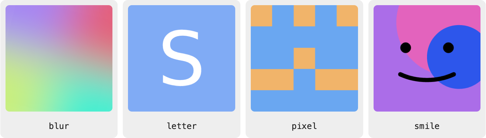

# No-Face

An API for generating default profile pictures for users based on a username or other unique identifier.

<picture>
  <source srcset="docs/styles-dark.png" media="(prefers-color-scheme: dark)">
  
</picture>

Get more information and use it at [core.soxfox.me/no-face](https://core.soxfox.me/no-face)
